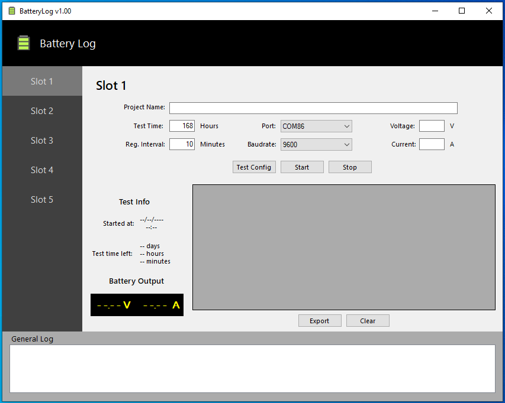
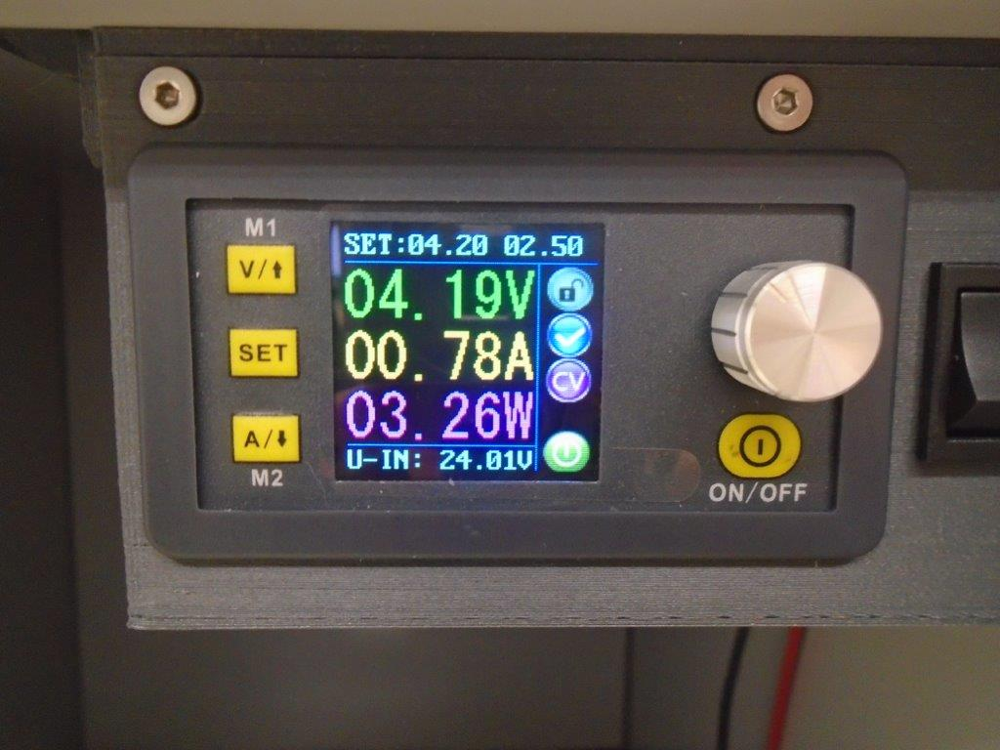
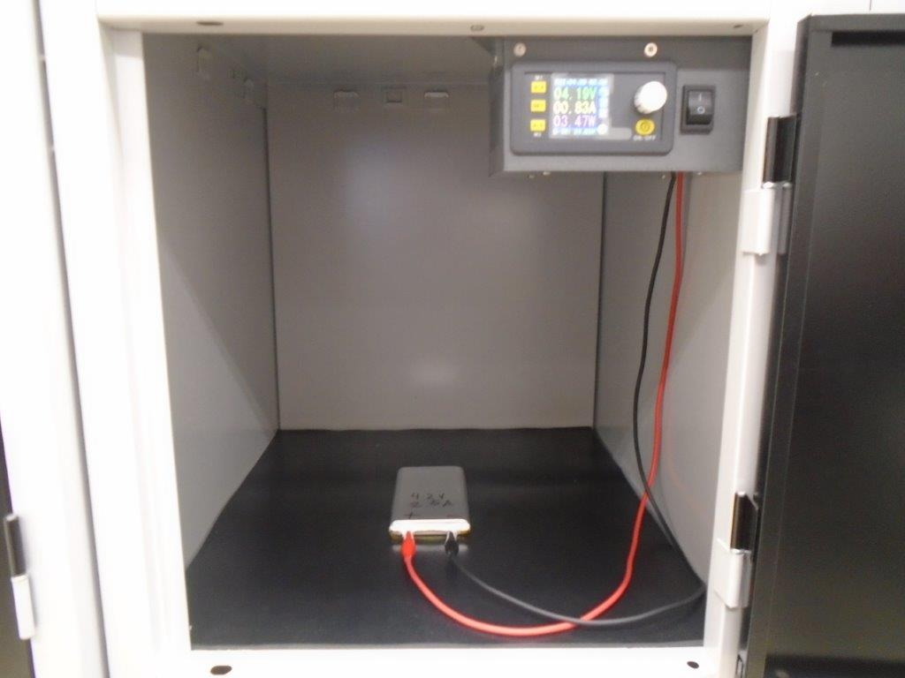
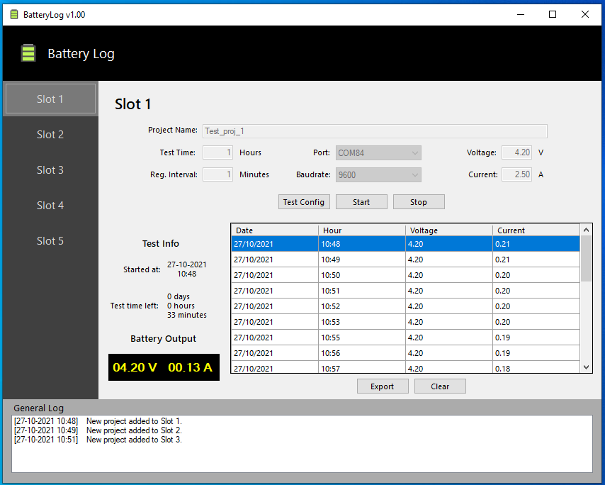
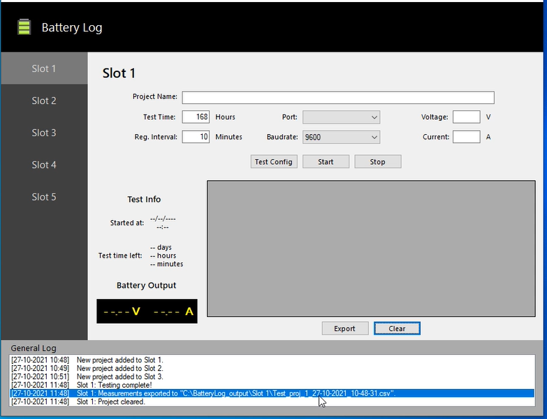
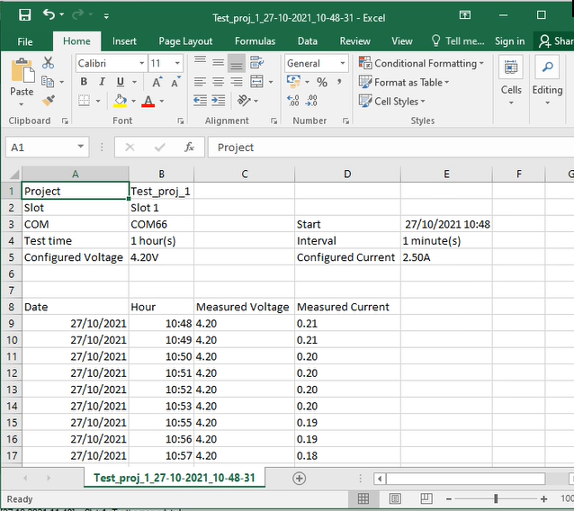

# Battery Log App

## Objective
This a desktop application to aid the execution of normative continuous charge testing for lithium batteries. Developed entirely in C# using the .NET Core environment and libraries.
It ables the configuration of multiple power outputs as well the registry of the levels through all the testing time using Ruideng's DPS5015 controller as hardware.
Some of the key concepts applied in this project are threading (through beackground workers), serial communication and documents/directories manipulation in the Windows OS.

## Features
The app presents 5 slots to run tests in 5 lithium battery samples concurrently. For each slot there are fields and options regarding the project characteristics and configurations to be transmitted to the controller which will power the battery sample:

As a new project is added, it will be displayed the starting time, time left to finish the test and voltage and current levels in real time. It is also displayed a data grid with all the records of voltage and current respecting the interval set in the project configuration:

All the actions and project status updates will be recorded in the general log list box. As a project is finished the user is able to export the records in the data grid as well clear the entire slot to accommodate a new project. When exported, the output document (a ".csv" file) will be saved in a default directory:

